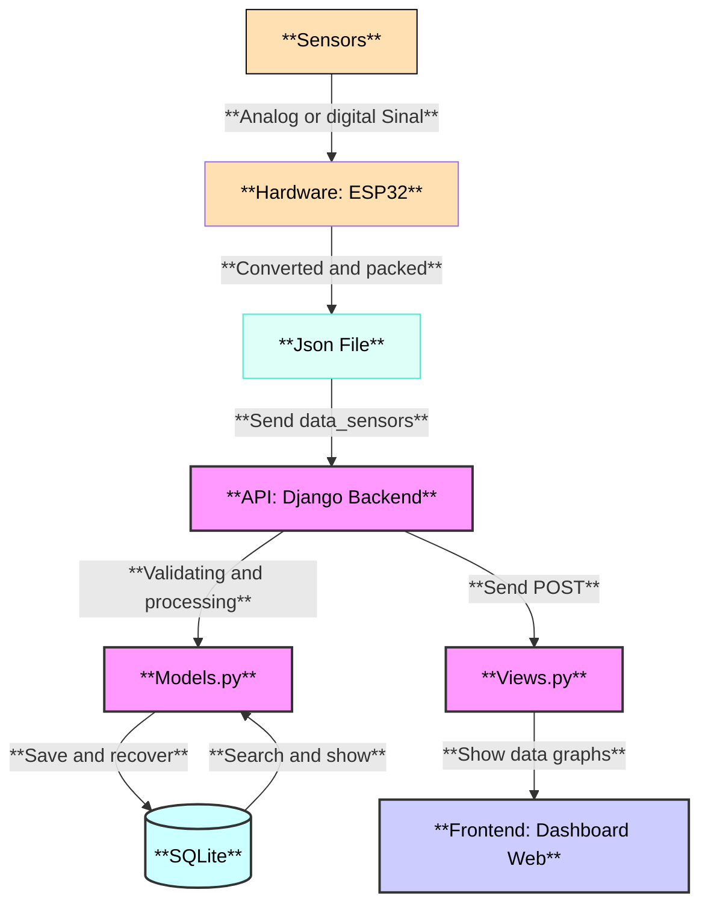

# EcoView - Sistema de Visualização de Dados em Tempo Real

Sistema completo para coleta, armazenamento e visualização de dados em tempo real de sistemas desenvolvidos pelo Grupo de Pesquisas em Modelagem HidroAmbiental e Ecotecnologias da UFSM.

## Sumário
- [Funcionalidades](#funcionalidades)
- [Tecnologias Utilizadas](#️-tecnologias-utilizadas)
- [Como Usar](#como-usar)
- [Arquitetura de Software](#arquitetura-de-software)
- [Contribuição](#contribuição)
- [Licença](#licença)
- [Contato](#contato)

## Funcionalidades

- Coleta de dados em tempo real via API REST
- Dashboard interativo com gráficos dinâmicos (Chart.js)
- Gerenciamento de dados com tabelas paginadas e filtros
- Suporte a múltiplos sensores e dispositivos
- Exportação de dados (CSV, JSON, Excel)
- Atualização de firmware OTA (Over the Air)

## 🛠️ Tecnologias Utilizadas

| Componente | Tecnologias                                                         |
|------------|---------------------------------------------------------------------|
| Backend    | Python 3.9+, Django 4.2, Django REST Framework, SQLite              |
| Firmware   | C++ (Arduino Core), ESP32                                           |
| Frontend   | HTML5, Bootstrap 5, Chart.js (para gráficos de histórico)           |
| Sensores   | DS18B20, DHT-11, UV, Anemômetro                                    |

## Como Usar

- Acesse o sistema pelo navegador (endereço do servidor).
- Cadastre-se e aguarde autorização do administrador.
- Após login, acesse o dashboard para visualizar dados em tempo real.
- Exporte dados conforme necessário.

## Arquitetura de Software

## Contribuição

1. Faça um fork do repositório
2. Crie uma branch (`git checkout -b feature/nova-feature`)
3. Realize os commits das suas alterações
4. Envie um Pull Request

## Licença

Este projeto está sob a licença MIT.

## Contato

- **Luize Baldoni de Oliveira**  
  Acadêmica de Engenharia de Computação - UFSM  
  Técnica em Informática para Internet - CTISM/UFSM  
  E-mail: [oliveira.luize@acad.ufsm.br](mailto:oliveira.luize@acad.ufsm.br)

**Grupo de Pesquisas em Modelagem HidroAmbiental e Ecotecnologias - UFSM**  

