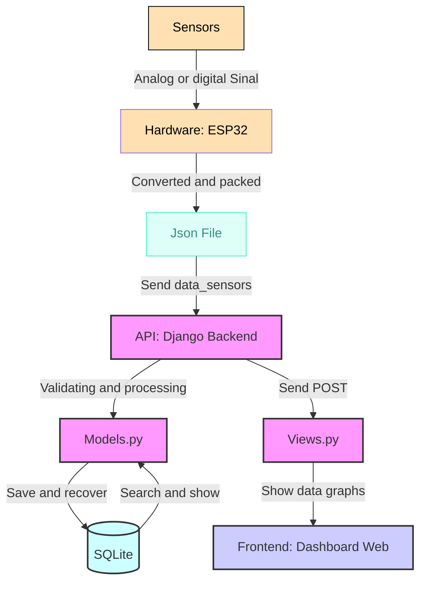

# EcoView Sistema de visualização de dados em tempo real

Sistema completo para coleta, armazenamento e visualização de dados em tempo real de sistemas desenvolvidos pelo Grupo de Pesquisas em Modelagem HidroAmbiental e Ecotecnologias da UFSM.

## Funcionalidades

- **Coleta de dados em tempo real** via API REST
- **Dashboard interativo** com visualizações Chart.js
- **Gerenciamento de dados** com tabelas paginadas e filtros
- **Multi-dispositivos** acompanhamento de vários sensores
- **Exportação de dados** (CSV, JSON, Excel)
- **Atualização de Firmware** Over the Air (OTA)

## 🛠️ Tecnologias Utilizadas

| Componente | Tecnologias                                                         |
|------------|---------------------------------------------------------------------|
| Backend    | Python 3.9+, Django 4.2, Django REST Framework, SQLite              |
| Firmware   | C++ (Arduino Core), ESP32                                           |
| Frontend   | HTML5, Bootstrap 5, Chart.js (para gráficos de histórico)           |
| Sensores | DS18B20, DHT-11, UV, ANEMOMETRO|

## Arquitetura de Software
